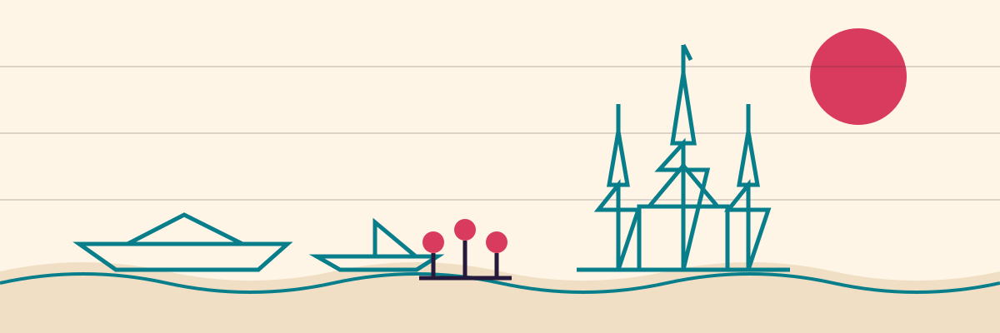

# Bangkok Tech Week

[Bangkok Tech Week](https://bangkoktechweek.com) is a citywide builder week taking shape for founders, engineers, designers, investors, operators, and community hosts across Bangkok, Thailand.

The public website is intentionally simple while the program is being prepared. Follow the Luma calendar to get notified when updates open.

[Get notified on Luma](/#launch)

## Media Kit

Official logos, usage notes, colors, and typography are available at
[bangkoktechweek.com/media-kit](https://bangkoktechweek.com/media-kit/).

## What To Expect

- Community-hosted rooms across Bangkok, Thailand.
- Founder conversations, technical sessions, demos, and meetups.
- A public calendar that makes the week easy to discover and follow.

## Links

- Website: [bangkoktechweek.com](https://bangkoktechweek.com)
- Media kit: [bangkoktechweek.com/media-kit](https://bangkoktechweek.com/media-kit/)
- Launch updates: published on the official website
- Media kit: https://bangkoktechweek.com/media-kit/
